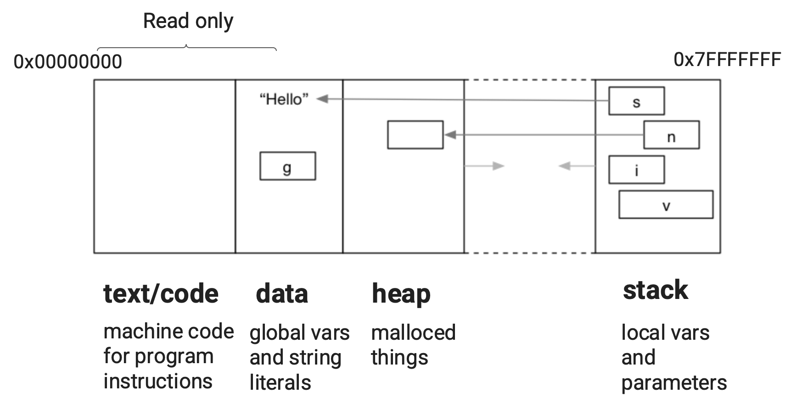

# Revision


## Memory

2. The following snippet of C code declares two variables, `s1` and `s2`, with some subtle differences between them.

   ```c
   #include <stdio.h>
   
   // where does s1 (the char pointer) live in memory?
   // where do the characters it points to live in memory?
   char *s1 = "abc"; // s1 is stored in data, string literals
   int a = 4;
   
   int main(int argv, char *argc) {
     	// where does s2 (the char pointer) live in memory?
   		// where do the characters it points to live in memory?
       char *s2 = "def"; // s2 is stored on the stack, "def" itself is stored in data
       // ...
   }
   ```

   - What is a *global variable*?

   Variable that's defined outside of any function and can be referenced from any function. Stored in the data section

   - How do they differ from local variables? Where are they each located in memory?

   Local variables only exist within the function they're defined in. Stored in the stack

   - What is a string literal? Where are they located in memory?

   Hardcoded array of characters. Stored in data.

   - What does the memory layout of a typical program look like?

   


2. What is wrong with the following code?                   **demo in `fix_ptr.c`**

   ```c
   // Tutorial 1, Question 3.
   
   #include <stdio.h>
   
   int *get_num_ptr(void);
   
   int main(void) {
       int *num = get_num_ptr();
       printf("%d\n", *num);
   }
   
   // Ensure the value is still set in this function
   // Do not change return type
   int *get_num_ptr(void) {
       int x = 42;
       return &x;
   }
   ```

   Assuming we still want `get_num_ptr` to return a pointer, how can we fix this code?

   How does fixing this code affect each variable's location in memory?

​	


## Recursion

7. Consider the following C program:  

   ```c
   #include <stdio.h>
   
   int sum(int n);
   
   // This program scans in a number n and prints the sum of all integers up to and including n. 
   // Rewrite the sum function so it uses recursion instead of a loop.
   // What happens in memory when this program runs? What is the difference between the loop and recursive versions?
   
   int main(int argc, char *argv[]) {
           int n;
           printf("Enter a number: ");
           scanf("%d", &n);
   
           int result = sum(n);
           printf("Sum of all numbers up to %d = %d\n", n, result);
   
           return 0;
   }
   
   // Iterative solution
   int sum(int n) {
       int result = 0;
       for (int i = 0; i <= n; i++) {
           result += i;
       }
       return result;
   }
   
   // TODO - Recursive solution
   int sum(int n) {
   }
   ```

   This program scans in a number ```n``` and prints the sum of all integers up to and including ```n```. 

   Rewrite the sum function so it uses recursion instead of a loop.

   What happens in memory when this program runs? What is the difference between the loop and recursive versions?

   - In the iterative version, there is only one call to sum function and all the variables are stored on the stack
   - In the recursive version, a new block of memory is allocated in the stack for each call to the sum function to store the parameters.


## Command Line Arguments

8. 

```c
#include <stdio.h>

int main(int argc, char *argv[]) {
    printf("argc=%d\n", argc);
    for (int i = 0; i < argc; i++) {
        printf("argv[%d]=%s\n", i, argv[i]);
    }
    return 0;
}
```

What are argc and argv in the program above?

argc is the amount of command line arguments

argv is an array of the command line arguments themselves


What will be the output of the following commands?

```
$ dcc print_arguments.c
$ ./a.out I love 4
```

argc = 4

argv[0] = "./a.out"

argv[1] = "I"

argv[2] = "love"

argv[3] = "4" 


9. The following program sums up command-line arguments.

Why do we need the function atoi in the following program?

We cannot add strings in c, atoi converts the string to an int

```c
#include <stdio.h>
#include <stdlib.h>

int main(int argc, char *argv[]) {
    int sum = 0;
    for (int i = 0; i < argc; i++) {
        sum += atoi(argv[i]);
    }
    printf("sum of command-line arguments = %d\n", sum);
    return 0;
}
```


## Extra


5. Write a c program `count_chars.c` that uses [getchar](https://man7.org/linux/man-pages/man3/getchar.3p.html) to read in characters until the user enters Ctrl-D and then prints the total number of characters entered.

​	Use `man 3 getchar` to look at the manual entry.


6. Consider the following while loop:

   ```c
   #include <stdio.h>
   
   int main(void) {
     // int i = 0;
     // while (i < 10) {
     //    printf("%d\n", i);
     //    i++;
     // }
     
     for (int i = 0; i < 10; i++) {
       	printf("%d\n", i);
     }
     
     return 0;
   }
   ```

   How could we rewrite the above program using a for loop? What subtle difference would there be between the two programs?