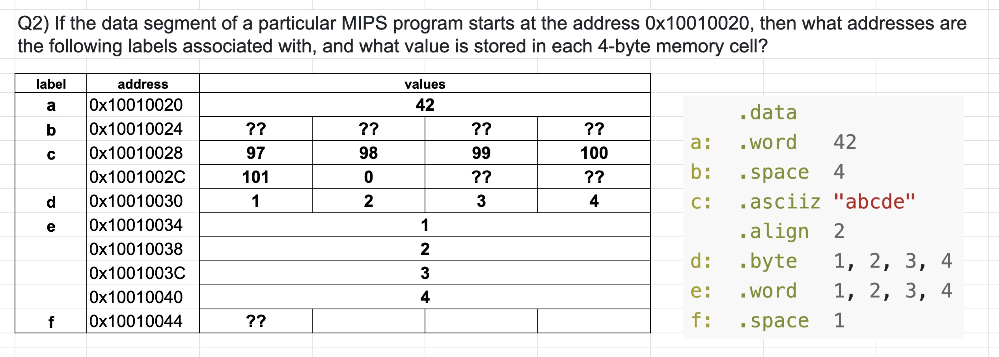

# Arrays/Memory in MIPS



3. Assuming that we are placing the variables in memory, at an appropriately-aligned address, and with a label which is the same as the C variable name, give MIPS directives to represent the following variables:

   a) `int u;`

   ```assembly
   u:		.space 4
   ```

   b) `int v = 42;`

   ```assembly
   v:		.word 42
   ```

   c) `char w;`

   ```assembly
   w:		.space 1
   ```

   d) ```char x = 'a';```

   ```assembly
   x:		.byte 'a'
   ```

   e) `double y;`

   ```assembly
   y:		.space 8
   ```

   f) ```int z[20];```

   ```assembly
   z:		.space 80
   ```


4. Consider the following memory state:

   ```
   Address       Data Definition
   0x10010000    aa:  .word 42
   0x10010004    bb:  .word 666
   0x10010008    cc:  .word 1
   0x1001000C         .word 3
   0x10010010         .word 5
   0x10010014         .word 7
   ```

   What value will be loaded into register `$t0`, after each of the following statements?

   ```assembly
   la   $t0, aa				# $t0 = 0x10010000
   ```

   ```assembly
   lw   $t0, bb				# $t0 = 666
   ```

   ```assembly
   lb   $t0, bb				# $t0 = 0x9a
   ```

   ```assembly
   lw   $t0, aa+4			# $t0 = 666
   ```

   ```assembly
   la   $t1, cc
   lw   $t0, ($t1)			# $t0 = 1
   ```

   ```assembly
   la   $t1, cc
   lw   $t0, 8($t1)		# $t0 = 5
   ```

   ```assembly
   li   $t1, 8
   lw   $t0, cc($t1)		# $t0 = 5
   ```

   ```assembly
   la   $t1, cc
   lw   $t0, 2($t1)		# Error as address provided is not divisible by 4
   ```


5. Translate this C program to MIPS assembler.         **demo in `read_to_memory.(c|s)`**

   ```c
   // A simple program that will read 10 numbers into an array
   
   #define N_SIZE 10
   
   #include <stdio.h>
   
   int main(void) {
       int i;
       int numbers[N_SIZE] = {0};
   
       i = 0;
       while (i < N_SIZE) {
           scanf("%d", &numbers[i]);
           i++;
       }
   }
   ```


6. Translate this C program to MIPS assembler         **demo in `read_from_memory.(c|s)`**

   ```c
   // A simple program that will print 10 numbers from an array
   
   #define N_SIZE 10
   
   #include <stdio.h>
   
   int main(void) {
       int i;
       int numbers[N_SIZE] = {99, 88, 77, 66, 55, 44, 33, 22, 11, 0};
   
       i = 0;
       while (i < N_SIZE) {
           printf("%d\n", numbers[i]);
           i++;
       }
   }
   ```


