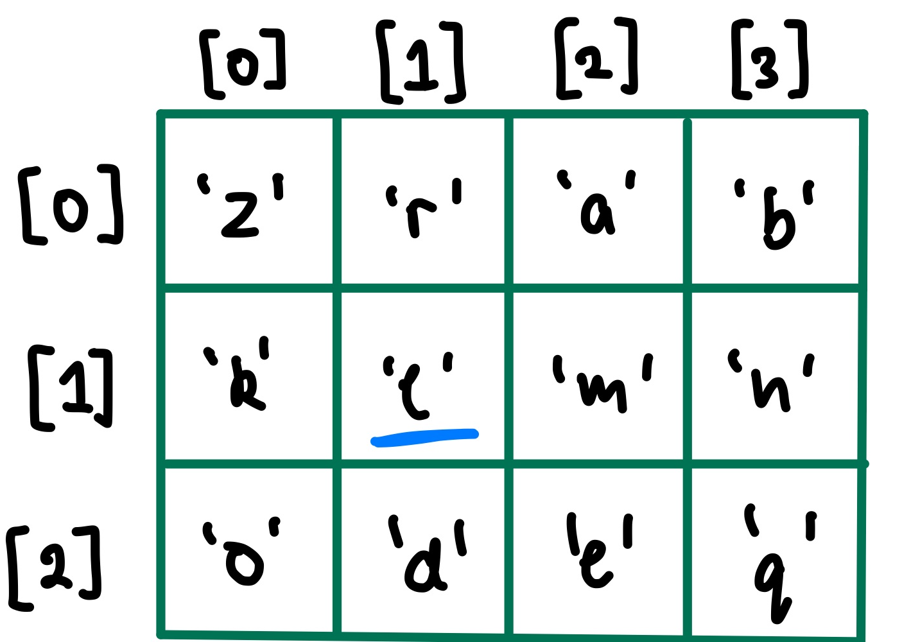
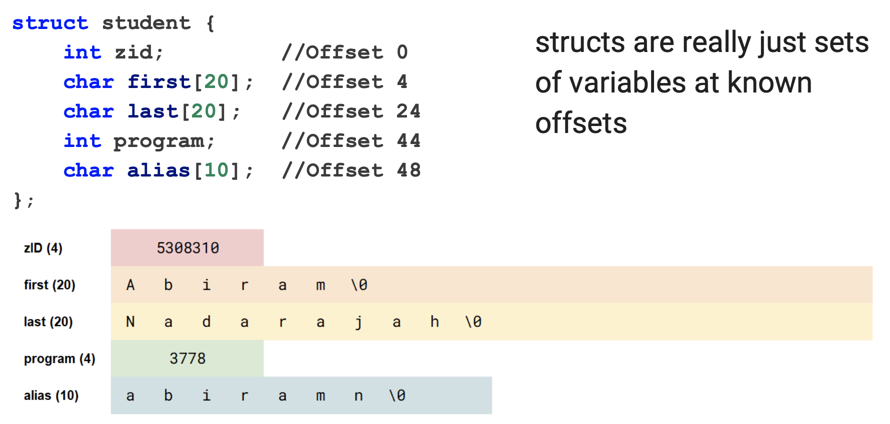
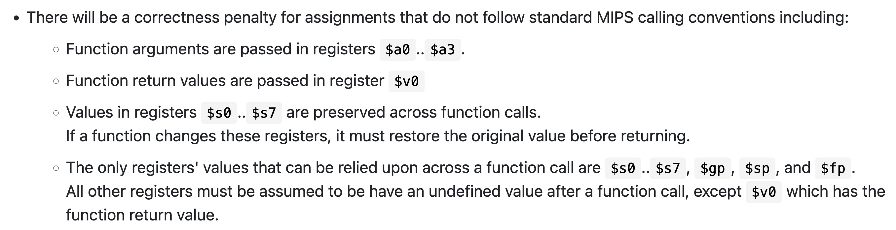

# Multidimensional Arrays

### ```char game_board[MAX_HEIGHT][MAX_WIDTH];```



How would we find the address of where the underlined variable is located?

```assembly
&gameboard[1][1] = gameboard[0][0] + (MAX_WIDTH * 1 + 1)

// General formula
array[row][col] = array[0][0] + (row * MAX_WIDTH + col) * SIZEOF(element)
```


# Structs



In MIPS, it would look something like this:

```assembly
	# Constants
ZID_OFFSET = 0
FIRST_OFFSET = 4
LAST_OFFSET = 20 + FIRST_OFFSET
PROGRAM_OFFSET = 20 + LAST_OFFSET
ALIAS_OFFSET = 4 + PROGRAM_OFFSET

main:
	...
	# Assuming the fields have been loaded for student1, how would you load the program 	     # field into register $t0?
	
	# Load or store instruction? load
	# What is the size of the element to figure out the instruction? word, lw
	
	# What address are we loading from, which register do we want to load it into
	la		$t0, student1
	addi	$t0, $t0, PROGRAM_OFFSET
	lw		$t0, ($t0)
	
	# Another method
	li		$t0, PROGRAM_OFFSET
	lw		$t0, student1($t0)
	
	# Another method
	lw		$t0, student1 + PROGRAM_OFFSET

	.data
student1:		.space 58
```


# Multi-function MIPS Program

In the assignment 1 spec:

#### 


```c
int example(int value) { // Non-leaf function means we must consider using $s registers
		int i, j, k; // Local variables (except for arrays) are stored in registers
  
  // Think about do your variables need to survive a function call
  // Between initialisation and the last time it's used, is there a function call between
  
  	i = 5;								// i in $t0
  	k = max(i, value); 		// k in $s0
  	j = get_num();  			// j in $t1
  
  	return j + k;
}
```

```assembly
example:
example__prologue: # Every non-leaf function must push/pop $ra at the minimum
									 # and every $s register
		push		$ra
		push		$s0
	
example__body:
		li			$t0, 5
		
		move		$a1, $a0
		move		$a0, $t0
		jal			max					
		move		$s0, $v0		# k = max(i, value)
		
		jal			get_num
		#move		$t1, $v0		# j = get_num()
		
		add			$v0, $v0, $s0
example__epilogue:
		pop			$s0
		pop			$ra
		
		jr			$ra
```

1. When translating to MIPS, what should we look out for when deciding which registers to use?

2. Do we need to push and pop anything? 

   


